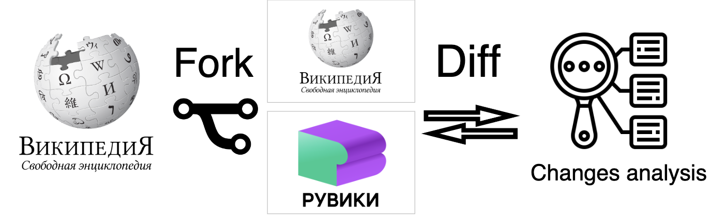
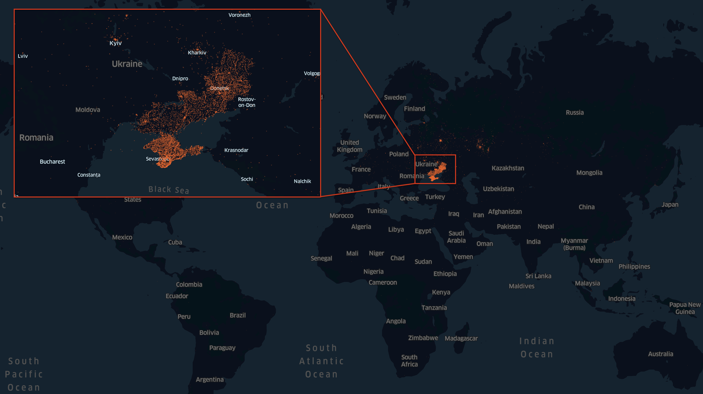
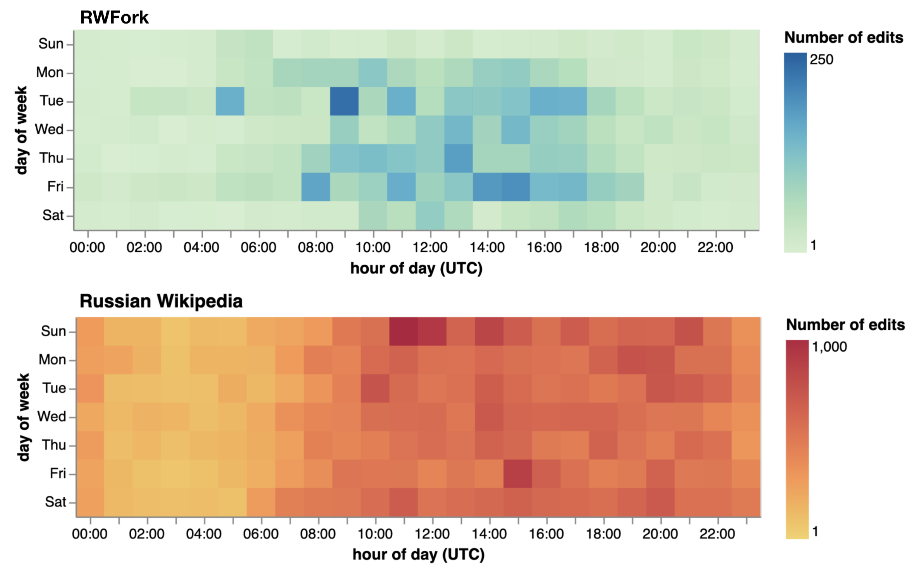

# RWFork Knowledge Manipulation Analysis

<!-- 
 -->

A repository that includes the code for experiments for paper "Characterizing Knowledge Manipulation in a Russian Wikipedia Fork" accepted to ICWSM'25. 

In the paper, we analyze the edits made by editors of the Russian Wikipedia Fork (RWFork, ruwiki.ru) to the original Russian Wikipedia articles between May and September 2023.

The final curated dataset is available at - Zenodo: 

 

## Structure: 
- **01-relevance_evaluation.ipynb** code used for answering *RQ1* (Evaluating the RELEVANCE OF CHANGED ARTICLES).
- **02-NE-EDA.ipynb** code with analysis of named entities changes in text. (*RQ2*)
- **03-temporal-analysis.ipynb** code for temporal patterns analysis in editing activity. (*RQ2*)
- **04-geospatial_topic_analysis_references.ipynb** code for analysis of patterns in categories, topics, locations. (*RQ2*)
- **05-iterative_clustering.ipynb** code for clustering changes and defining changes taxonomy. (*RQ3*)
